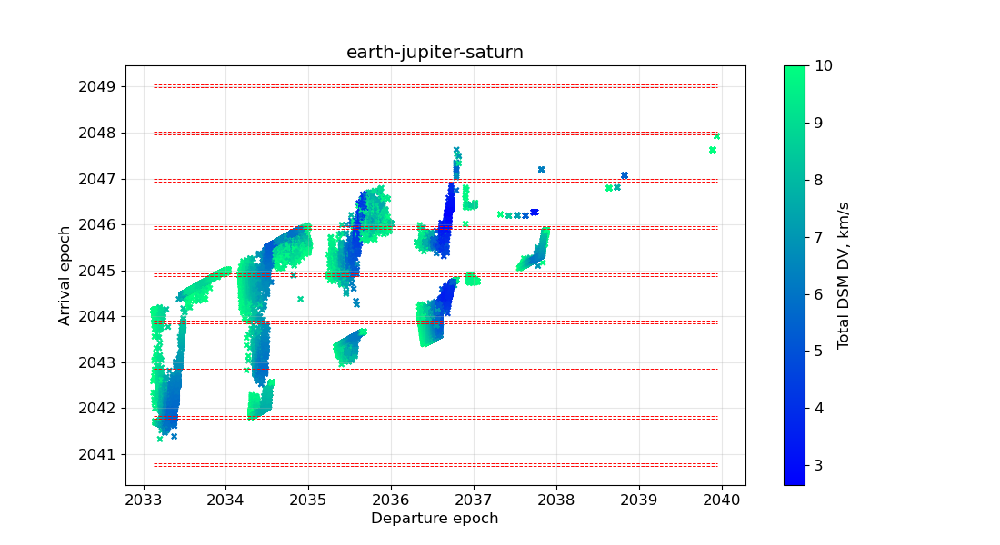

# Caltech Space Challenge 2022

### `pyexplorer` module dependencies

Python 3.8.12

Dependencies: `pykep`, `pygmo`, `numba`, `numpy`, `scipy`, `tqdm`, `spiceypy`, [`polaris`](https://github.com/Yuricst/polaris)

```python
import pyxplorer as pxp
```

### Directory overview

- `./pyexplorer` is the package where some of the utility functions & [pygmo](https://esa.github.io/pygmo2/) problems (based on [pykep's MGA-1DSM formulation](https://esa.github.io/pykep/documentation/trajopt.html#pykep.trajopt.mga_1dsm)) are implemented.
- `./notebooks` contains Jupyter notebooks used to develop/run codes for analysis, plotting, etc.
- `./runs` contains scripts used to generate optimization data (i.e. local optimal solutions, since trajectory problem was sought via global optimization over launch windows spanning years)
- `./cosmo` contains catalog files for visualizing the trajectory (interplanetary part) using [NAIF's Cosmographia](https://naif.jpl.nasa.gov/naif/cosmographia.html)


### Gallery

<p align="center">
  
</p>


<p align="center">
  
</p>


<p align="center">
  
</p>
